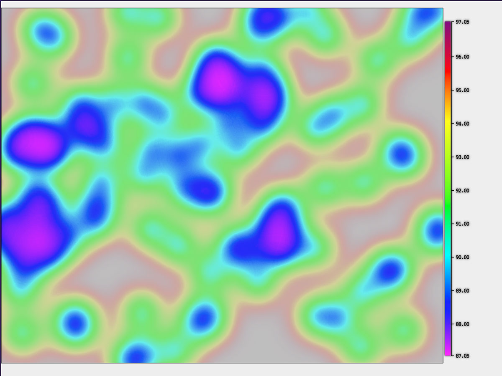
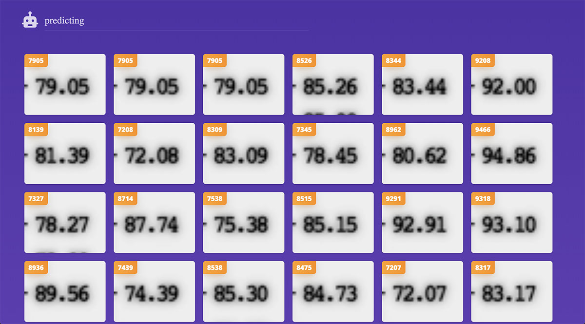

# Digit recognition with ML5.js

This is a very minimal example of using ML5.js to recognize digits from frames of a video using transfer learning as presented during a talk at the JSDayIE 2019 conference in Dublin which you can watch on [youtube](https://www.youtube.com/watch?v=6FtrpEGQHzE). Ignore the bored presenter, he's a dick.



This repo contains dummy data as the real data cannot be shared. For the sneak peek of what the actual data looked like, and to understand the motivation of why I've even bothered to do this in the first place, you can watch [the relevant part](https://youtu.be/6FtrpEGQHzE?t=298) of my talk.

## Run locally

You'll need to open `index.html` server from a local webserver. If you're on Mac OS X, and you're using Python 2, the easiest way of doing this is to open the terminal, cd into the project root and run:

```
python -m SimpleHTTPServer 8009
```

and then open `http://localhost:8009/` in your browser.



If you're struggling to set up a local webserver, [this guide](https://developer.mozilla.org/en-US/docs/Learn/Common_questions/set_up_a_local_testing_server) might help. Hopefully.

## How's this working

The example is using [ml5.js](https://ml5js.org) library to re-train the Mobilenet model with a custom dataset. I've chosen to use ML5.js as I find it to be the simplest possible way of starting with machine learning. It offers a simple API on top of the tensorflow.js library, which is probably what you would end up using if you wanted to do something more serious or complicated. 

For an example of how you'd achieve a similar result with Tensorflow.js, please have a look at the [tensor-js-digit-recognition](https://github.com/zdenekhynek/tensor-js-digit-recognition) repo. 

### Transfer learning

This is bit complicated but essentially you're taking a fully-trained model, in our case Mobilenet, remove the last layer of its neural network, as it contains labels we don't care about, and replace it with a layer trained on your dataset, in our case examples of different digits.

If you've managed to finish that previous sentence, you get a golden star. Well done you!

You can watch me struggle to explain it [here](https://youtu.be/6FtrpEGQHzE?t=591). For a real explanation, you can read [this](https://machinelearningmastery.com/transfer-learning-for-deep-learning/) or watch [the Coding train explanation](https://www.youtube.com/watch?v=aKgq0m1YjvQ) which is way more fun anyway.

### Training images

The training images are stored at `/data/training`. There are a couple of folders each containing 10 small images with different digits. By default, we use images from the first four folders to train the model. You can increase the amount of training data used at.

### Code implementation

There are a couple of lines which deal with the actual machine learning, the rest of Javascript is mostly to help load the images and extract relevant bitmap data from them.

1) We start with instantiating the ml5.js feature extractor, which is what they call transfer learning. The second parameters are options to define the architecture of our model. We pass 10 for `numLabels` as we have 10 different classes to identify in total. One for each digit. Like '0', '1', '2' etc. You know how numbers work, right?

```
featureExtractor = ml5.featureExtractor("MobileNet", { numLabels: 10 }, modelLoaded);
```

2) Then we get a classifier from the featureExtractor, as our problem is a classification problem. We're trying to find out
if a particular image belongs to a certain class ("Is this an image of number 5"). And not a regression for instance ("Which would be predicting a continuous value"). 

```
classifier = featureExtractor.classification();
```

3) Then we do the actual transfer learning by re-training the classification model with our own data. For each digit, we provide a couple of examples of bitmap data. The reason we give the classifier multiple examples for each digit is so that there's bigger variety in the training data.

The data we worked with is generated, so the digits should technically all look the same, however, due to the small font-size, the digits bleed together a little bit, so number 4 will look slightly differently if it's next to number 7 or number 9 for instance. For our dummy dataset, we simulate that by cropping the digits always slightly different.

```
classifier.addImage(image.image, image.label);
```

4) And finally, we can use the trained classifier to predict digits from our video frames stored at `/data/frames`. Each prediction is an array of probabilities that given image belongs to one of the 10 classes. It's asynchronous so we use await to pause the execution until we get the result.

```
await classifier.classify(imgNew);
```

## This sucks, it's making mistakes

You suck. Also, yeah, sorry. It doesn't work that great on the generated dummy data as on the real data. You can try increasing the number of training images by going to at the very top of `scripts.js`. E.g.:

```
const NUM_TRAIN = 7;
```

What a great opportunity to tweak it yourself and get better results!

## Next steps

Have a look at the [ml5.js examples](https://ml5js.org/reference/) and [watch the Coding train videos](https://www.youtube.com/watch?v=jmznx0Q1fP0&list=PLRqwX-V7Uu6YPSwT06y_AEYTqIwbeam3y).

If you want to go more low-level, you should also check out [Tensorflow.js tutorials](https://www.tensorflow.org/js/tutorials).

And if you happen to be based in London, come to the [AI Javascript London meetup](https://www.meetup.com/AI-JavaScript-London/) to have an absolute delight of meeting me in person. Also, it's a good meetup. You don't have to talk to me. 
